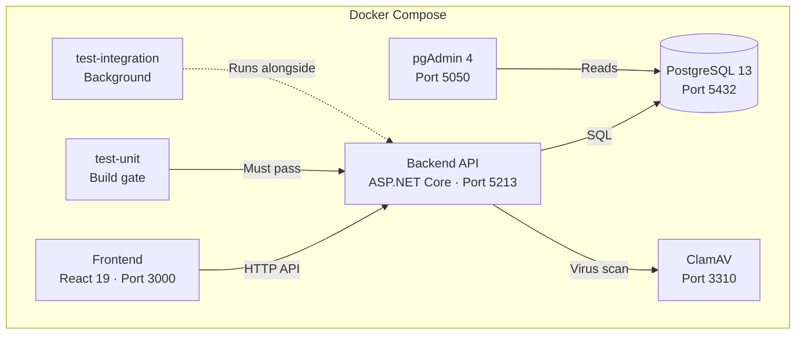

# 📊 BankStatements

**Personal financial management — upload bank statement PDFs, parse transactions, and analyse your spending.**

| | |
|---|---|
| **Backend** | .NET 10 · ASP.NET Core · Dapper · PostgreSQL 13 · JWT |
| **Frontend** | React 19 · TypeScript 6 · Vite 8 · Axios |
| **Infrastructure** | Docker Compose · ClamAV · pgAdmin 4 |

---

## Features

- **PDF Statement Upload** — Upload bank statement PDFs (max 10 MB) with automatic duplicate detection via SHA256 hashing
- **Transaction Parsing** — Extract individual transactions including dates, descriptions, amounts, and categories from PDFs using pattern-based parsing
- **Spending Analysis** — View aggregated spending summaries by category, total credits/debits, and cashflow with configurable date ranges
- **Secure Authentication** — Email/password registration with BCrypt hashing, plus OAuth via Google and Auth0
- **Account Lockout** — 5 failed attempts triggers a 15-minute lockout; rate limiting prevents credential enumeration
- **Virus Scanning** — Uploaded files are scanned with ClamAV before processing
- **Docker-First Build** — All services run via Docker Compose with a test-gate pipeline that blocks broken builds

---

## Architecture



**Service dependency flow:**
1. `test-unit` runs first — if tests fail, the build stops
2. `db` and `clamav` start in parallel
3. `backend` starts after `test-unit` passes, `db` is up, and `clamav` is healthy
4. `frontend` starts after `backend`
5. `test-integration` runs alongside all services in the background

---

## Getting Started

### Prerequisites

- [Docker Desktop](https://www.docker.com/products/docker-desktop/) (with Compose V2)
- Git

### Setup

```bash
# 1. Clone the repository
git clone <repo-url>
cd bankStatements

# 2. (Optional) Copy the default .env and customise
# The .env file is already provided with dev defaults

# 3. Build and start everything (Windows)
.\docker-up-build.ps1

# Or (Linux / macOS)
./docker-up-build.sh

# Or manually
docker compose up --build
```

### Access the application

| Service | URL |
|---------|-----|
| Frontend | http://localhost:3000 |
| API | http://localhost:5213 |
| API Docs (Scalar) | http://localhost:5213/scalar (dev only) |
| pgAdmin | http://localhost:5050 |

### Demo Login

A seeded demo account is available:

- **Email:** `demo@example.com`
- **Password:** (seeded with a hashed password — use the register flow with this email or check `002_seed_data.sql` for the plaintext)

### Stop services

```bash
.\docker-down.ps1        # Windows
./docker-down.sh         # Linux / macOS
docker compose down      # Cross-platform
```

---

## API Endpoints

### Health

| Method | Path | Auth | Description |
|--------|------|------|-------------|
| `GET` | `/api/health` | No | API health check |

### Authentication

| Method | Path | Auth | Rate Limit | Description |
|--------|------|------|-----------|-------------|
| `POST` | `/api/auth/register` | No | 2 req/15min/IP | Register with email & password |
| `POST` | `/api/auth/login` | No | 2 req/15min/IP | Log in with credentials |
| `POST` | `/api/auth/refresh` | Cookie | 5 req/15min/IP | Refresh access token |
| `POST` | `/api/auth/logout` | JWT | — | Logout & revoke refresh token |
| `POST` | `/api/auth/external` | No | 5 req/15min/IP | OAuth login via ID token |
| `POST` | `/api/auth/external/code` | No | 10 req/15min/IP | OAuth code exchange (PKCE) |

### Statements

| Method | Path | Auth | Description |
|--------|------|------|-------------|
| `POST` | `/api/statements/upload` | JWT | Upload a PDF bank statement (max 10 MB) |

### Analysis

| Method | Path | Auth | Parameters | Description |
|--------|------|------|-----------|-------------|
| `GET` | `/api/analysis/summary` | JWT | `bankAccountId`, `from`, `to` | Get spending summary |

---

## Security

- **Password hashing** — BCrypt (via `BCrypt.Net-Next`)
- **JWT tokens** — 15-minute access tokens stored in-memory; 30-day refresh tokens in httpOnly `SameSite=Strict` cookies
- **Token rotation** — Each refresh issues a new token pair and revokes the old one
- **Rate limiting** — IP-partitioned limits on auth endpoints; global 100 req/min API limit
- **Account lockout** — 5 failed attempts → locked for 15 minutes (checked before password verification to prevent enumeration)
- **Virus scanning** — All uploaded PDFs scanned with ClamAV before processing
- **CORS** — Restricted to `localhost:3000` and `127.0.0.1:3000`
- **Port binding** — All services bind to `127.0.0.1` (localhost only, not `0.0.0.0`)

---

## Testing

Tests run inside Docker containers — do not run `dotnet test` directly.

```bash
# Run unit tests (build gate)
docker build --target test -t backend-tests ./backend
docker run --rm backend-tests

# Run integration tests (require Docker socket)
docker compose run --rm test-integration

# Full pipeline (unit gate → services → integration)
.\docker-up-build.ps1
```

**Test stack:** xUnit · Moq · FluentAssertions · Testcontainers.PostgreSql

Integration tests spin up a temporary PostgreSQL container via Testcontainers and run E2E auth flows.

---

## Project Structure

```
bankStatements/
├── backend/
│   ├── Statements.WebAPI/          # ASP.NET Core API
│   │   ├── Auth/                   # JWT services, password hashing
│   │   ├── Contracts/              # Request/response DTOs
│   │   ├── Controllers/            # API endpoint controllers
│   │   ├── Data/                   # Dapper + Npgsql data access
│   │   ├── Infrastructure/         # Type handlers, middleware
│   │   ├── Models/                 # Domain models
│   │   ├── Services/               # Business logic
│   │   │   ├── Analysis/           # Spending analysis service
│   │   │   ├── Auth/               # Authentication service
│   │   │   └── Statements/         # Statement upload & PDF parsing
│   │   ├── Program.cs              # App entry point & DI config
│   │   ├── appsettings.json        # Configuration
│   │   └── Logs/                   # Log files (14-day retention)
│   ├── Statements.WebAPI.Tests/    # xUnit unit + integration tests
│   ├── Uploads/                    # Uploaded PDF storage
│   └── Dockerfile                  # Multi-stage: test → runtime
├── frontend/
│   ├── src/
│   │   ├── App.tsx                 # Main React component
│   │   ├── components/             # UI components
│   │   └── services/               # API client (Axios)
│   ├── public/                     # Static assets
│   ├── Dockerfile                  # Node.js dev container
│   └── package.json                # npm scripts
├── database/
│   └── init/                       # SQL migrations (auto-run on DB start)
│       ├── 001_create_tables.sql   # Core schema
│       ├── 002_seed_data.sql       # Demo data
│       ├── 003_add_scan_columns.sql # ClamAV columns
│       └── 004_add_user_lock_columns.sql # Account lockout
├── docker-compose.yml              # Full-stack orchestration
├── docker-up-build.ps1 / .sh       # Build & start scripts
├── docker-down.ps1 / .sh           # Stop scripts
└── .env                            # Environment variables (gitignored)
```

---

## Configuration

Key environment variables (see `.env` for full list and defaults):

| Variable | Description |
|----------|-------------|
| `ConnectionStrings__DefaultConnection` | PostgreSQL connection string |
| `Jwt__Secret` | JWT signing key (min 32 characters) |
| `Jwt__Issuer` | Token issuer (`Statements.WebAPI`) |
| `Jwt__Audience` | Token audience (`Statements.Client`) |
| `Jwt__AccessTokenMinutes` | Access token lifetime (15) |
| `Jwt__RefreshTokenDays` | Refresh token lifetime (30) |
| `ClamAv__Host` | ClamAV server hostname |
| `ExternalProviders__Google__ClientId` | Google OAuth client ID |
| `ExternalProviders__Auth0__Authority` | Auth0 tenant domain |
| `VITE_API_BASE_URL` | Frontend API base URL |
| `VITE_GOOGLE_CLIENT_ID` | Frontend Google OAuth client ID |

---

## Contributing

This project follows a **Docker-first build policy**. All build, run, and test operations must use Docker — never run `dotnet`, `npm`, or `npx` directly.

See [`.github/copilot-instructions.md`](.github/copilot-instructions.md) for the full policy.

---

## License

MIT
