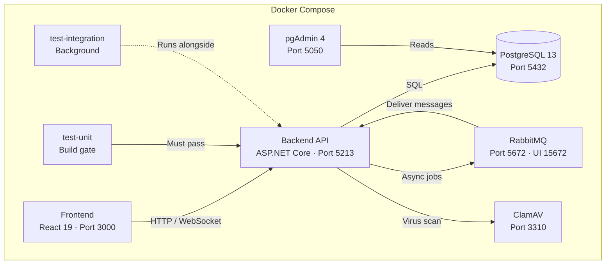

# 📊 BankStatements

**Personal financial management — upload bank statement PDFs, parse transactions, and analyse your spending.**

| | |
|---|---|
| **Backend** | .NET 10 · ASP.NET Core · Dapper · PostgreSQL 13 · JWT · RabbitMQ |
| **Frontend** | React 19 · TypeScript 6 · Vite 8 · SignalR |
| **Infrastructure** | Docker Compose · RabbitMQ · ClamAV · pgAdmin 4 |

---

## Features

- **PDF Statement Upload** — Upload bank statement PDFs (max 10 MB) with automatic duplicate detection via SHA256 hashing
- **Async Background Processing** — Virus scan → enqueue → parse → insert, all via RabbitMQ. Upload returns instantly
- **Real-time Status** — Processing status (uploaded → processing → processed/failed) pushed via SignalR WebSocket
- **Transaction Parsing** — Extract dates, descriptions, amounts, and categories from PDFs using pattern-based parsing
- **Transaction Editing** — Double-click any transaction to edit descriptions and reassign categories
- **CSV Export** — Download transactions as CSV for use in Excel, Google Sheets, or other tools
- **Spending Analysis** — View aggregated spending by category, total credits/debits, and cashflow with configurable date ranges
- **Monthly Budgets** — Set budgets per category; see progress bars with ok/warning/over indicators
- **Statement Management** — View all uploaded statements with status badges and retry failed ones
- **Secure Authentication** — Email/password with BCrypt, plus OAuth via Google and Auth0
- **Account Lockout** — 5 failed attempts triggers a 15-minute lockout; rate limiting prevents credential enumeration
- **Virus Scanning** — All uploaded files scanned with ClamAV before processing
- **Docker-First Build** — All services run via Docker Compose with a test-gate pipeline

---

## Architecture



**Service dependency flow:**
1. `test-unit` runs first — if tests fail, the build stops
2. `db`, `clamav`, and `rabbitmq` start in parallel
3. `backend` starts after tests pass and all dependencies are healthy
4. `frontend` starts after `backend`
5. `test-integration` runs alongside in the background

---

## Getting Started

### Prerequisites

- [Docker Desktop](https://www.docker.com/products/docker-desktop/) (with Compose V2)
- Git

### Setup

```bash
# 1. Clone the repository
git clone <repo-url>
cd bankStatements

# 2. Build and start everything
docker compose up --build
```

### Access the application

| Service | URL |
|---------|-----|
| Frontend | http://localhost:3000 |
| API | http://localhost:5213 |
| API Docs (Scalar) | http://localhost:5213/scalar (dev only) |
| RabbitMQ UI | http://localhost:15672 (guest/guest) |
| pgAdmin | http://localhost:5050 |

### Stop services

```bash
docker compose down
```

---

## Project Structure

```
bankStatements/
├── backend/
│   ├── Statements.WebAPI/          # ASP.NET Core API (controllers, services, contracts)
│   ├── Statements.WebAPI.Tests/    # xUnit tests (210+ unit + integration)
│   ├── Uploads/                    # Uploaded PDF storage
│   └── Dockerfile
├── frontend/
│   ├── src/
│   │   ├── App.tsx                 # Main component
│   │   ├── components/             # 11 UI components
│   │   ├── hooks/                  # Custom hooks (SignalR)
│   │   └── services/               # API client
│   ├── Dockerfile
│   └── package.json
├── database/
│   └── init/                       # SQL migrations (001-007)
├── docker-compose.yml              # Full-stack orchestration (7 services)
├── .env                            # Environment variables
├── docker-up-build.ps1 / .sh       # Build & start scripts
└── docker-down.ps1 / .sh           # Stop scripts
```

---

## Testing

Tests run inside Docker containers.

```bash
# Unit tests (210+ tests)
docker compose run --rm test-unit

# Integration tests (require Docker socket)
docker compose run --rm test-integration
```

**Test stack:** xUnit · Moq · FluentAssertions · Testcontainers.PostgreSql

---

## Security

- **Password hashing** — BCrypt
- **JWT tokens** — 15-minute access tokens in memory; 30-day refresh tokens in httpOnly `SameSite=Strict` cookies
- **Token rotation** — Each refresh issues a new pair and revokes the old one
- **Rate limiting** — IP-partitioned on auth; 100 req/min global API limit
- **Account lockout** — 5 failed attempts → 15-minute lockout
- **Virus scanning** — All uploaded PDFs scanned with ClamAV
- **CORS** — Restricted to `localhost:3000`
- **Port binding** — All services bind to `127.0.0.1` only
